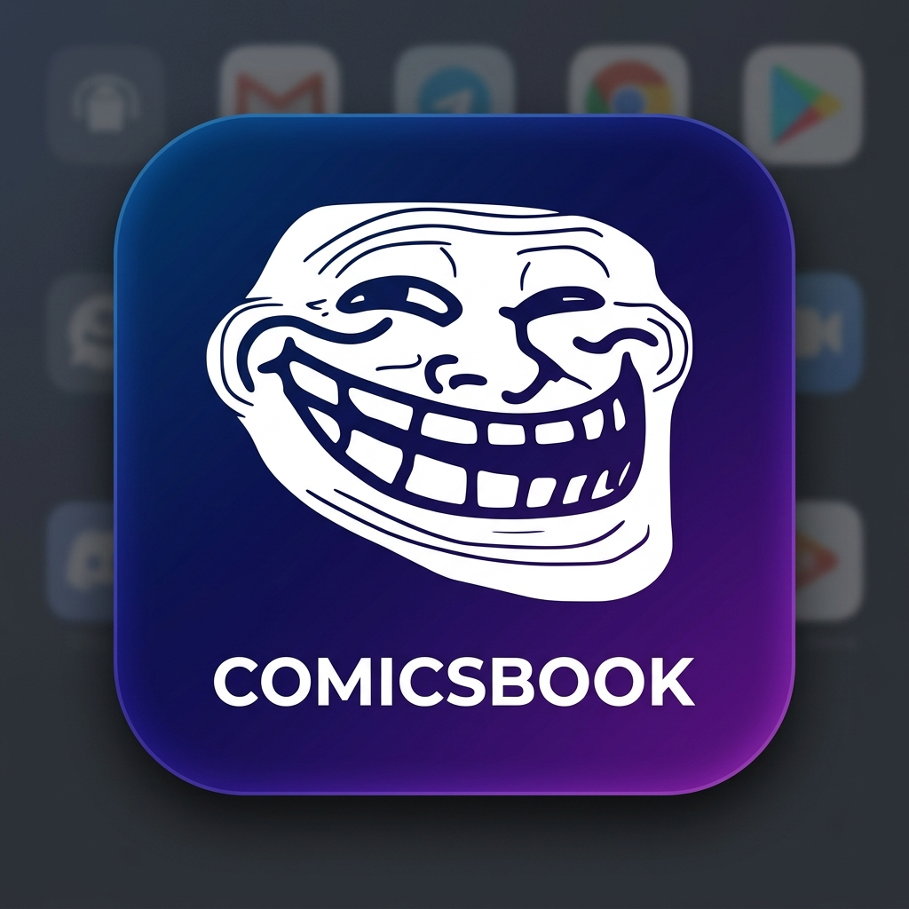

<p align="center">
  
</p>

<h1 align="center">Comicsbook.ru Archive & Museum</h1>

<p align="center">
  <i>Архивный проект по сохранению и воссозданию легендарного развлекательного портала комиксов и мемов</i>
</p>

<p align="center">
  <a href="DONATION.md"></a>
  
  
  
</p>

---

Этот проект представляет собой некоммерческую инициативу по архивации и сохранению контента некогда популярного российского развлекательного ресурса **Comicsbook.ru**, закрывшегося много лет назад. 

Репозиторий объединяет в себе комплекс скриптов для парсинга исторического наследия сайта из веб-архивов (Wayback Machine), классическую серверную версию портала для локального компьютера, а также мобильное приложение для Android с поддержкой оффлайн-режима.

---

## Готовые сборки (Releases)

Для обычных пользователей, желающих установить готовое приложение на телефон, **нет необходимости настраивать окружение или запускать скрипты сбора данных**. 

В разделе **[Releases](https://github.com/RandoTeam/comicsbook.ru-archive/releases)** доступны предсобранные мобильные пакеты (`.apk`) со встроенной оптимизированной базой данных и архивом изображений.

---

## Архитектура проекта

Проект разделен на несколько независимых, но интегрированных компонентов:

### 1. Мобильное приложение (React + Cordova)
* **Клиентская часть (`react_app/`)**: Современное SPA-приложение, разработанное на React 18 и Vite. Поддерживает динамическую смену тем (светлая, темная, OLED), создание пользовательских папок для организации избранного, сквозной локальный поиск и умную систему кэширования позиции чтения (скролла) при перезапуске приложения.
* **Мобильный контейнер (`cordova_app/`)**: Обертка Apache Cordova, которая упаковывает скомпилированное React-приложение в нативный Android-пакет, настраивает поведение статус-бара и организует безопасный доступ к локальной файловой системе устройства.

### 2. Локальный веб-сервер (Flask)
* **`app.py`**: Веб-приложение на Flask, реализующее классический интерфейс оригинального сайта Comicsbook.ru для комфортного просмотра архива на настольных ПК напрямую из SQLite-базы данных `comics.db`.

### 3. Набор утилит парсинга (Python Scrapers)
Автоматизированный комплекс для извлечения данных из Internet Archive Wayback Machine:
* **`scrape_ratings.py`**: Главный скрипт сбора. Использует CDX API веб-архива для поиска проиндексированных страниц, а затем в многопоточном режиме обходит снимки страниц, парсит метаданные (заголовок, категорию, автора, оригинальную дату публикации, рейтинг) и вносит их в локальную базу.
* **`scrape_remaining.py`**: Утилита докачки, отслеживающая незавершенные или упавшие сессии парсинга и подбирающая альтернативные снимки страниц для восстановления пропущенных записей.
* **`scrape_comments.py`**: Скрипт воссоздания комментариев. Извлекает древовидные ветки дискуссий под каждым постом, очищает их от кодировочных артефактов и сохраняет связи авторов с постами.
* **`download_comics_webp.py`**: Оптимизатор медиа-библиотеки. Скачивает оригинальные изображения комиксов и на лету конвертирует их в современный легковесный формат WebP для экономии пространства внутри мобильного приложения.

### 4. Автоматизация сборки
* **`build_android.py`**: Единый скрипт оркестрации сборки. Он компилирует React-код, экспортирует реляционную SQLite базу данных в формат `data.json` для оффлайн-чтения, переносит оптимизированные изображения в директорию Cordova и запускает сборку релизного подписанного Android-пакета (`.apk`).

---

## Инструкции по развертыванию

### Настройка локального сервера Flask (для ПК)

1. Установите необходимые Python-зависимости:
   ```bash
   pip install Flask requests urllib3
   ```
2. Убедитесь в наличии файла базы данных `comics.db` в корневой папке.
3. Запустите веб-сервер:
   ```bash
   python app.py
   ```
4. Откройте в браузере адрес [http://127.0.0.1:5000](http://127.0.0.1:5000).

### Сборка React Frontend

1. Перейдите в каталог фронтенда:
   ```bash
   cd react_app
   ```
2. Установите Node-модули:
   ```bash
   npm install
   ```
3. Запустите сборку:
   ```bash
   npm run build
   ```

### Сборка мобильного приложения Android

Для автоматического формирования релизного пакета запустите корневой скрипт сборки:
```bash
python build_android.py
```
Скрипт автоматически подготовит веб-дистрибутив, перенесет изображения из локальной папки `upload/` в ресурсы Cordova, экспортирует записи базы данных и скомпилирует подписанный `.apk` файл.

---

## Поддержка проекта

Разработка и поддержка архивной инфраструктуры выполняется на добровольных началах. Ознакомиться с подробным описанием целей проекта и найти способы пожертвований (включая QR-коды для криптовалют) можно в файле **[DONATION.md](DONATION.md)**.

---

## Отказ от ответственности (Disclaimer)

Этот репозиторий является некоммерческим историческим архивом. Все графические материалы и тексты комментариев получены из открытых публичных снимков сервиса Wayback Machine. Авторы репозитория не претендуют на права собственности на оригинальный пользовательский контент. 

Если вы являетесь автором какого-либо изображения, представленного в архиве, и возражаете против его нахождения в публичном доступе, отправьте обращение через вкладку **Issues**, и мы немедленно удалим указанный материал.

---

## Лицензия

Исходный код утилит, парсеров и интерфейса React распространяется под свободной лицензией **MIT**. Подробности описаны в файле [LICENSE](LICENSE).
