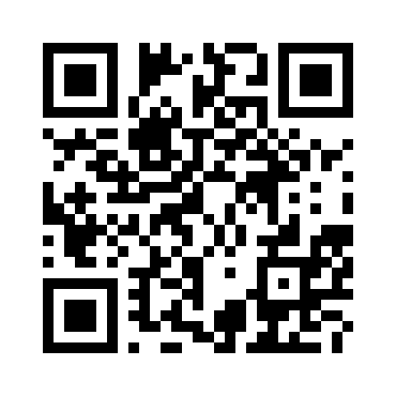
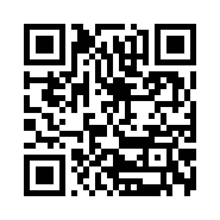

# Comicsbook.ru Archive & Museum 🏛️

Это некоммерческий проект по сохранению и архивации культового российского мем-портала **Comicsbook.ru**, который прекратил свое существование. 

Этот репозиторий содержит исходный код современного кроссплатформенного приложения (React + Cordova), а также скрипты для парсинга и восстановления базы данных комиксов из **Web Archive (Wayback Machine)**.

Цель проекта — создать удобный "интернет-музей" для тех, кто хочет вспомнить золотую эпоху мемов, полистать старые посты, сохранить любимые комиксы в папки и проникнуться ностальгией.

## 🚀 Возможности приложения
- **Полный оффлайн-доступ** (после скачивания базы и кэширования картинок).
- **Собственный парсер** для восстановления данных из Web Archive.
- **Современный UI**: Темная, Светлая и OLED темы.
- **Организация контента**: Сохранение постов в Избранное, создание собственных пользовательских папок для мемов.
- **Нативное мобильное приложение** для Android (собрано через Apache Cordova).

## 🛠 Технологии
- **Frontend**: React, Vite, Vanilla CSS.
- **Mobile Wrapper**: Apache Cordova.
- **Backend / Scraper**: Python (BeautifulSoup, Requests).

## ⚖️ Отказ от ответственности (Disclaimer)
> Данный проект является **некоммерческим историческим архивом** (интернет-музеем) закрывшегося сайта Comicsbook.ru. 
> 
> Все материалы и метаданные постов были получены из открытых публичных архивов (Wayback Machine) и представлены здесь **исключительно в исторических, ностальгических и образовательных целях**.
> 
> Разработчики этого репозитория не претендуют на авторство оригинального пользовательского контента (UGC). Если вы являетесь законным правообладателем какого-либо графического материала или персонажа, представленного в архиве, и желаете, чтобы он был удален, пожалуйста, создайте **Issue** в данном репозитории, и контент будет незамедлительно удален.

## ☕ Поддержать автора (Support the Project)
Архивация десятков тысяч мемов, парсинг полумертвого архива и разработка мобильного приложения — это долгий и кропотливый труд. Проект является абсолютно бесплатным и открытым, но если он вызвал у вас теплую ностальгию, и вы хотите поддержать дальнейшую разработку (или просто угостить автора кофе), вы можете сделать добровольный донат. **[Подробнее о том, почему это важно, читайте здесь](DONATION.md)**.

| Криптовалюта | Сеть | Адрес кошелька | QR-код |
|:---:|:---:|---|:---:|
| **Bitcoin** | Bitcoin | `bc1qd5s9dwvyvlv320ynluk66zpd0p24knzxrjzwvr` |  |
| **Ethereum** | Ethereum | `0xfca2fc261d4f23768a04ec49c3448278cdf17c2b` |  |
| **USDT** | Ethereum (ERC-20) | `0xfca2fc261d4f23768a04ec49c3448278cdf17c2b` |  |
| **USDC** | Ethereum (ERC-20) | `0xfca2fc261d4f23768a04ec49c3448278cdf17c2b` |  |

*Все донаты добровольны и идут на оплату серверов, времени разработки и покупку кофе.* ❤️

## 📄 Лицензия кода
Исходный код самого приложения (парсеры, UI, обертка) распространяется под свободной лицензией **MIT License**. Вы можете свободно модифицировать, форкать и использовать код для создания собственных архивных проектов.

---
*Сделано с ❤️ к старым мемам.*
